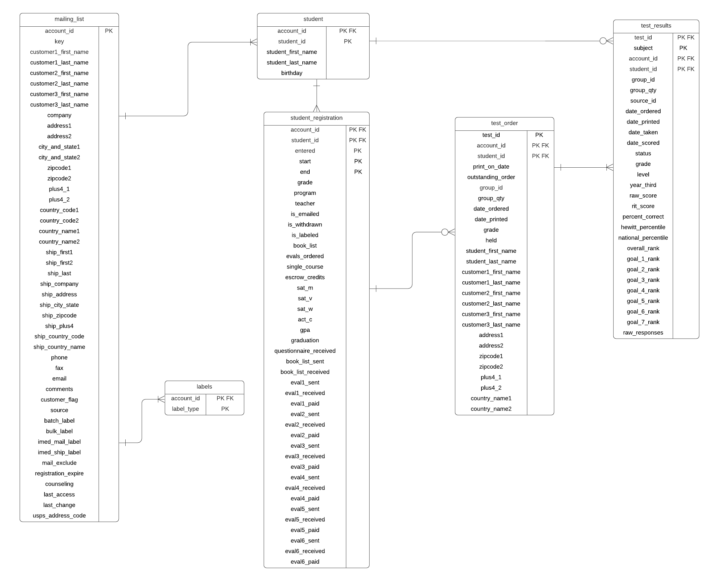
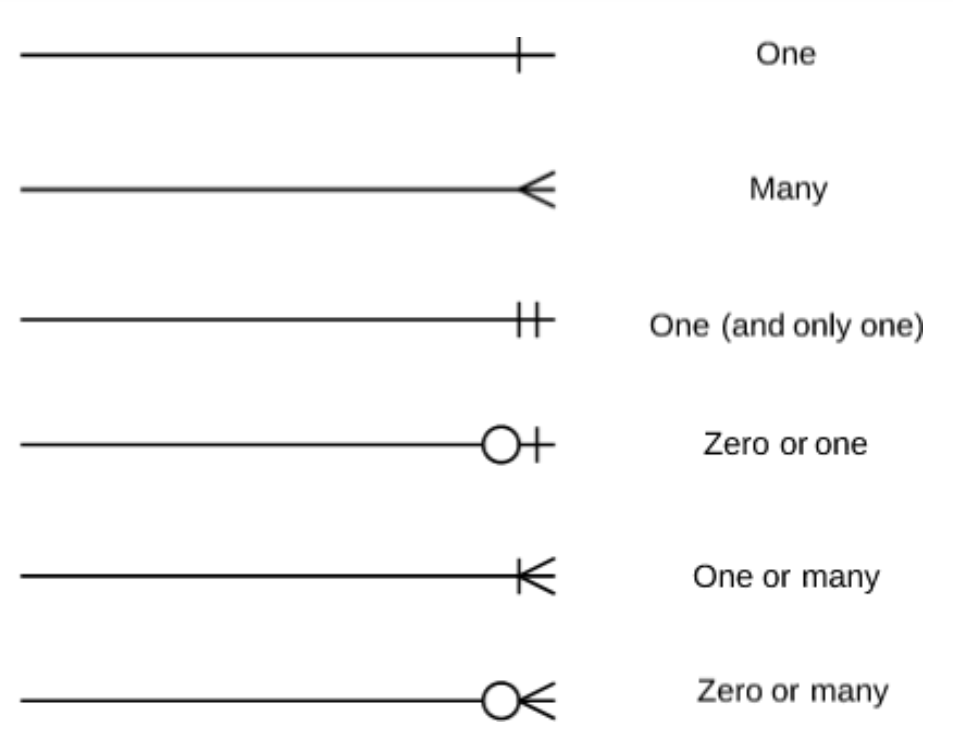

# Data Migration and Normalization

This directory chronicles the process that we took in transitioning Hewitt's database from their outdated MS DOS system called Paradox over to the robust, modern database management system MS SQL.  It was an arduous task accessing their data because Paradox is no longer a supported DBMS.  The normalization process also took a lot longer than we originally anticipated.  

## Data migration

Hewitt's tech expert Jared was nice enough to compile all of their data from their Paradox database into a Google Drive file and emailed it to us.  Jared also set up a virtual machine where we were able to use the most recent Microsoft Windows version that was compatible with Paradox (Windows XP).  This allowed us to interface with the Paradox database in a way that simulated how Hewitt was currently interacting with their data.  The problem is that Paradox files are not ones that you can just access easily on contemporary systems.  So we were immediately inspired to get out of Paradox land as quickly as possible.

### Initial data conversion process

Throughout our early research process, we discovered that manually converting a database from Paradox to a robust SQL database like Access, MySQL Server or Salesforce would actually be a significantly tedious, intricate, difficult process.  Paradox is a Microsoft DOS application created in 1985; very little documentational support remains to assist in using it.  We had stumbled accross a software application called Full Convert made by an Irish company called Spectral Core.  They convert databases and have support for over 40 kinds of databases.  The only problem is that because their application is a specialized, expert service they charge a substantial price.  A baseline standard membership is $700.  On a whim, Ethan sent the Spectral Core Management a hope and a prayer email requesting a one-time complimentary membership just so that we could convert Hewitt's database.  While we were waiting for a response from Spectral Core, we decided to move forward in the process of trying to manually convert the database.

The first step in the manual conversion process was finding a program called Paradox Data Editor (Link: https://www.softpedia.com/get/Internet/Servers/Database-Utils/Paradox-Data-Editor.shtml).
This software application took the Pardox .DB files and converted them into CVS files.  This made the files accessible and we were then able to convert them to Access files. Once we had all of the Paradox files converted to Access files, we cross referenced all of the files to make sure that everything got converted accurately.  Then we found an application called Bullzip MS Access to MySQL (https://www.bullzip.com/products/a2m/info.php) that would enable us to take the final step in converting our files into MySQL.

### The Final Solution to converting our Paradox data

At this point in time, the heavens opened up and Ethan received a response from the Spectral Core CEO obliging our request!  This was so huge because, even though we had already converted a lot of the data ourselves, we were noticing a lot of discrepancies in the manual conversion.  We knew that utilizing Full Convert would provide instant peace of mind and cut out a substantial amount of time doing manual conversion work.  So, ultimately we chose to take them up on their offer and use Full Convert to convert all of the data from Hewitt's Paradox database to MySQL. Full Convert made the conversion extremely easy and fast.  Once we had the data in the format we needed, it enabled us to move forward building it into a MySQL database that we can alter, manipulate and enhance.

Full Convert can be found at: https://www.spectralcore.com/fullconvert.

## Normalizing Hewitt's Database

This directory chronicles the process we undertook in normalizing Hewitt's database.  There were a variety of limitations that Hewitt had always dealt with as a result of having a Paradox database management system.  The Paradox Database Management system put strange, arbitrary limitations on certain data types and naming conventions of database elements, did not provide support for auto incrementing attributes and did not support the use of foreign keys.  We have addressed all of these issues.  The following is a list of the specific focus areas of our database normalization process:

 * Rename tables using human-readable names
 * Remove any capital letters in table names or attribute names per industry standard
 * Remove any spaces in attribute names and replace with underscores per industry standard
 * Set up auto incrementing functionality for the attributes in Hewitt's website that need to be incremented upon any insertion of a new tuple
 * Set up foreign keys relating all corresponding tables to each other
 * Delete unnecessary tables per Hewitt's explicit instruction
 * Delete unncessary attributes per Hewitt's explicit instruction

### img

This directory contains both before and after screenshots that display what the Hewitt database tables looked like before we began normalization versus what the resulting database tables looks like.  Generally speaking, the images correspond with each other.  So, for example the original Hewitt tables featured in the Before_DB1 image correspond to the newly named tables featured in the After_DB1 image.  However, since these images were taken we've decided on even further simplifications of the database due to the realization that many of the tables had 1 to 1 relationships.  The images are included in the img directory README and the final db schema is the final picture in the README.

### Miscellaneous Information

The following miscellaneous bullet points may be of interest to Hewitt as they move forward integrating the new system:

 * We had to change the data types of the auto incrementing attributes (account_id and test_id) from DOUBLE to INT per MySQL's requirement.  This necessitated changing the data types of any foreign key attributes corresponding to those auto incrementing attributes from DOUBLE to INT as well for conformity.
 * We set up the referential integrity constraint for each foreign key to "CASCADE" for now.  This means that any update or deletion of a parent table primary key that is a foreign key in a child table will cascade its effects to the child table.  So, for example if an account_id in a parent table is deleted or modified, the same effect will occur in the tables that have attributes referencing it.  This constraint can be changed in the future if you find that "CASCADE" isn't optimal for your database.  It is, however, our perception that you want the effects of parent table primary key changes to be cascaded.
 * We added auto incrementing to the mailing_list account_id attribute and the test_order test_id attribute, per our discussion with Jared.  We added dummy tuples to test the auto incrementing functionality and it is working as expected.  You should no longer need to keep the z_control tables that were holding your sequence id values. 
 * Unfortunately, we did not document the previous attribute names for most of the tables before we changed them.  I'm really sorry about that.  However, you should be able to readily cross reference and discern from your old system to the new one specific attributes and what they got changed to if needed.  For the tables that we did document the old attribute names, we will include those in this file. 
 * The identification attributes within the database (Account #, Student #, Group #) were changed to account_id, student_id and group_id, respectively.

### In Depth Table Analysis

This section chronicles the changes made to each and everyone of Hewitt's database tables for Hewitt's potential need for future reference as they work on integrating the new system into their everyday use.

A miscellaneous note of interest about the specific tables:

 * The Hewitt database contains many backup tables and sequencing tables that hold the current sequence values for their auto incrementing attributes.  As they will likely not need these tables after they've integrated to this new system, we did not perform many edits to these kinds of tables.

#### LABELS

 * This is a table used by Hewitt for printing functionality
 * Changed table name to labels
 * Created a composite primary key composed of the account_id and label_type attributes.  I was going to use just the account_id attribute as a primary key but after further discussion with Jared and Kristin, it was determined that it is possible for the same account_id to show up multiple times in the labels table, so for this reason I used both table attributes as a composite primary key
 * Added a single foreign key named label_acct composed of the account_id attribute that references the mailing_list table

#### ML

 * This is Hewitt's primary table holding the parent/guardian/group leaders of Hewitt students account and mailing information.  The primary identification attribute is called account_id and is unique to each customer/family/group leader and is thus the primary key of this table
 * Changed table name to mailing_list
 * Per Hewitts instruction, we deleted the following unnecessary columns: PP Flag, TW Flag, HG Flag, AA Flag, AB Flag, PP Date, TW Date, HG Date, AA Date, AB Date, CART, DELPT, Export Flag
 * Changed the data type of the email attribute from VARCHAR(30) to VARCHAR(40) to give more space for unusually long email addresses so that Hewitt should no longer have to add overflow into the comments attribute
 * Changed the address attribute to address1, the city_and_state attribute to city_and_state2, the zipcode attribute to zipcode2, the plus4 attribute to plus4_1, the country_code attribute to country_code2 and the country_name attribute to country_name2
 * Added address2, city_and_state2, zipcode2, plus4_2, country_code2 and country_name2 attributes to allow Hewitt to store 2 addresses corresponding to the same account_id.  The ever increasing complexity of the world we live in necessitates this
 * Added extra attributes to allow the functionality of having 3 separate customers within an account_id each with unique and possibly different first and last names as well as 2 email addresses and 2 phone number columns in the event that 2 customers from 1 account need to have their email addresses/phone numbers stored in the system
  

#### REENROLL

 * This table held information for when students were enrolled in Hewitt High School.  
 * Per Hewitt's instruction, we combined this table with the STDREGHD and STDREGLN tables into 1 student information table named student
 * The following tuples were manually added from the REENROLL table into the coupled student table:

   | **<i>account_id</i>** | **_name_** |
   --------- | ---------
   | 40929 | ROBERT BOYD |
   | 65078 | FAITH PERA |
   | 78887 | TYLER LEE |
   | 82337 | SAMUEL FERRAGAMO |
   | 118128	| FAITH NIQUETTE |
   | 130262	| ANNA KINNUNEN |
   | 130262	| MORIAH KINNUNEN |
   | 133662	| JONATHAN BURNHAM |
   | 143445	| NITHYA VETHANAYAGAM |
   | 156097	| NOAH FUENTES |
   | 156154	| EMILY DAWSON |
   | 159571	| KELCI FOLSLAND |
   | 160986	| KOLE DUGGER |
   | 160986	| KAMDEN DUGGER |
   | 161228	| JAMES STORY |
   | 161228	| JAMES STORY |
   | 162834	| REBEKAH LITTLE |
   | 162977	| JACK SARTAIN |
   | 164570	| ISRAEL RUSCH |
   | 164658	| TARA HENDERSON |

 The following is a list of the old attribute names of the REENROLL table (that have now been combined into the student table) and what they were changed to:
  | **_former_ _attribute_ _name_** | **_new_ _attribute_ _name_** |
  |-------------------- | -----------------------|
  | END | end |
  | Program | program |
  | Grade | grade |
  | Student First Name | first_name |
  | Student Last Name | last_name |

#### STDREGHD

 * This was a student registration table within the Paradox system
 * Per Hewitt's instruction, we combined this table with the REENROLL and STDREGLN tables into 1 student information table named student

#### STDREGLN

 * This was a student registration table within the Paradox system
 * Per Hewitt's instruction, we combined this table with the REENROLL and STDREGHD tables into 1 student information table named student

 The following is a list of the old attribute names of the STDREGLN table (that have now been combined into 1 student table) and what they were changed to:

  | **_former_ _attribute_ _name_** | **_new_ _attribute_ _name_** |
  |-------------------- | -----------------------|
  | Grade | grade |
  | Teacher | teacher |
  | Withdrawn Flag | is_withdrawn |
  | Label Flag | is_labeled |
  | BookList | book_list |
  | Evals Ordered | evals_ordered |
  | Single Course | single_course |
  | Escrow Credits | escrow_credits |
  | SAT V | sat_v |
  | SAT M | sat_m |
  | SAT W | sat_w |
  | ACT C | act_c |
  | GPA | gpa |
  | Graduation | graduation |
  | Questionnaire Rcvd | questionnaire_received |
  | Book List Rcvd | book_list_received |
  | Book List Sent | book_list_sent |
  | Eval 1 Rcvd | eval1_received |
  | Eval 1 Sent | eval1_sent |
  | Eval 1 Paid | eval1_paid|
  | Eval 2 Rcvd | eval2_received |
  | Eval 2 Sent | eval2_sent |
  | Eval 2 Paid | eval2_paid|
  | Eval 3 Rcvd | eval3_received |
  | Eval 3 Sent | eval3_sent |
  | Eval 3 Paid | eval3_paid|
  | Eval 4 Rcvd | eval4_received |
  | Eval 4 Sent | eval4_sent |
  | Eval 4 Paid | eval4_paid|
  | Eval 5 Rcvd | eval5_received |
  | Eval 5 Sent | eval5_sent |
  | Eval 5 Paid | eval5_paid|
  | Eval 6 Rcvd | eval6_received |
  | Eval 6 Sent | eval6_sent |
  | Eval 6 Paid | eval6_paid |

#### STSIMPRT

 * TABLE DELETED FROM DB PER HEWITT'S REQUEST

#### STSORD

 * TABLE DELETED FROM DB PER HEWITT'S REQUEST

#### STSORD2

 * TABLE DELETED FROM DB PER HEWITT'S REQUEST

#### STSRSHD

 * TABLE DELETED FROM DB PER HEWITT'S REQUEST

#### STSRSLN

 * TABLE DELETED FROM DB PER HEWITT'S REQUEST

#### STUDENT

 * This is the primary Hewitt student table holding student information
 * Changed table name to student
 * Created a composite primary key composed of the account_id, student_id, entered, start, and end attributes.  A student is related to a parent/guardian by their account_id and within each unique account_id family/group each student has his/her own unique student_id number.  The entered, start and end attributes deal with when the student is involved with the Hewitt program.
 * Added a single foreign key named student_acct composed of the account_id attribute that references the mailing_list table (a student's account_id number is the same as their parent/guardian/group leader)
 * After much analysis with the Hewitt management we decided to combine all student registration tables (STDREGHD, STDREGLN, and REENROLL) with the general STUDENT table to create this table.  Because it had the most attributes and held the most tuples, this table was originally the STDREGLN table that I renamed student_registration and then pulled all of the data from STDREGHD and REENROLL over to and then combined using a SQL join statement with the student table.
 * The following is a list of the former attribute names of what was the STUDENT table and what they got updated to in the normalization process:

   | **_former_ _attribute_ _name_** | **_new_ _attribute_ _name_** |
   |-------------------- | -----------------------|
   | Account # | account_id |
   | Student # | student_id |
   | Student First Name | first_name |
   | Student Last Name | last_name |
   | Birthday | birthday |

 * The following is a list of the former attribute names from the STDREGHD, STDREGLN and REENROLL tables and what they got updated to in the normalization process:

    | **_former attribute name_** | **_new attribute name_** |
    |------------------ | ----------------------|
    | Account # | account_id |
    | Student # | student_id |
    | Entered   | entered |
    | Start | start |
    | End | end |
    | Student First Name | student_first_name |
    | Student Last Name | student_last_name |
    | Program | program |
    | Email Flag | is_emailed |
    | Grade | grade |
    | Teacher | teacher |
    | Withdrawn Flag | is_withdrawn |
    | Label Flag | is_labeled |
    | Book List | book_list |
    | Evals Ordered | evals_ordered |
    | Single Course | single_course |
    | Escrow Credits | escrow_credits |
    | SAT V | sat_v |
    | SAT M | sat_m |
    | SAT W | sat_w |
    | ACT C | act_c |
    | GPA | gpa |
    | Graduation | graduation |
    | Questionnaire Rcvd | questionnaire_received |
    | Book List Rcvd | book_list_received |
    | Book List Sent | book_list_sent |
    | Eval 1 Rcvd | eval1_received |
    | Eval 1 Sent | eval1_sent |
    | Eval 1 Paid | eval1_paid |
    | Eval 2 Rcvd | eval2_received |
    | Eval 2 Sent | eval2_sent |
    | Eval 2 Paid | eval2_paid |
    | Eval 3 Rcvd | eval3_received |
    | Eval 3 Sent | eval3_sent |
    | Eval 3 Paid | eval3_paid |
    | Eval 4 Rcvd | eval4_received |
    | Eval 4 Sent | eval4_sent |
    | Eval 4 Paid | eval4_paid |
    | Eval 5 Rcvd | eval5_received |
    | Eval 5 Sent | eval5_sent |
    | Eval 5 Paid | eval5_paid |
    | Eval 6 Rcvd | eval6_received |
    | Eval 6 Sent | eval6_sent |
    | Eval 6 Paid | eval6_paid |

 * We had trouble setting up the foreign key for this table because this table contained 13 rogue tuples that had no corresponding tuples in the mailing_list table with the same account_id numbers.  The following is a list of the 13 rogue tuples:

   | **<i>account_id</i>** | **<i>student_id</i>** | **<i>first_name</i>** | **<i>last_name<i>** | **_birthday_** |
   ---------- | ---------- | ---------- | ---------- | ----------
   | 148227 | 1 | AUSTIN | GADDY | NULL |
   | 155532 | 1 | JACOB | ADAMS | NULL |
   | 159400 | 1 | BRIANNA | DECOEUR | NULL |
   | 159401 | 1 | KACY | SHRADER | NULL |
   | 159401 | 2 | MICAH | SHRADER | NULL |
   | 159401 | 3 | MELANIE | SHRADER | NULL |
   | 159402 | 1 | DANIEL | BENNET | NULL |
   | 159611 | 1 | EMMY | MIRANDA | 2002-12-07 |
   | 165404 | 1 | LANDON | ORTLIEB | NULL | 
   | 165404 | 2 | DAMIEN | ORTLIEB | NULL |
   | 165766 | 1 | WERN | SCOTT | NULL |
   | 165766 | 2 | KAYLEE | SCOTT | NULL |
   | 165789 | 1 | KAI | ALAM | NULL |

 * Regarding these anomalous tuples, we were in high communication with Hewitt regarding a course of action.  We were not able to set up a foreign key until the issue was reconciled.  I proposed adding tuples into the mailing_list table that would correspond with these 13 tuples.  The following is a summary of Kristin's thoughts about simply adding account_id tuples into the mailng_list table to correspond to these tuples:
   * "My only concern is that these students might already exist under a different account number (created when these's didn't work). If they do, it would be an account number near in sequence to the one listed here. I guess this would be another piece where Jared and I can do some clean up as we encounter the issues going forward. So as long as the potential duplicate doesn't create an issue somewhere else, I'm good with you creating the account ID's to match the student ones. We'd also need to check that there is no corresponding data in the student test records. If these IDs don't show up anywhere but the student list and the students exist elsewhere, then I have no issue deleting these"
 * So at this point we were instructed to check and see if these students possibly exist elsewhere in the DB (this is because the Paradox system had experienced odd errors where they had to assign some students new account numbers).  If the students are already in the DB under a different account_id, then we could delete these tuples.  Otherwise, we should add corresponding account_id's to the mailing_list table so that the referential integrity constraint can be implemented. They said that if these students do exist then they will likely have account_id's very close in sequence to these rogue tuple account_id's.
 * After a detailed analysis, we discovered the following information:

1. Austin Gaddy shows up in test_order and z_test_order and z_test_rsbk1 and needed to have a corresponding mailing_list tuple added
2. Jacob Adams exists under account_id 155533 and had no other information within the database under account_id 155532 
3. Brianna Decoeur exists under accountid 159403 and had no other information within the database under account_id 159400
4. Kacy Shrader exists under account_id 159404 and had no other information within the database under account_id 159401
5. Micah Shrader exists under account_id 159404 and had no other information within the database under account_id 159401
6. Melanie Shrader exists under account_id 159404 and had no other information within the database under account_id 159401
7. Daniel Bennett exists under account_id 159405 and had no other information within the database under account_id 159402
8. Emmy Miranda shows up in test_score_hd and test_score_sln and z_test_rsbk2 and z_test_rsbk3 and needed to have a corresponding mailing_list tuple added
9. Landon Ortlieb exists under account_id 165405 and had no other information within the database under account_id 165404
10. Damien Ortlieb exists under account_id 165405 and had no other information within the database under account_id 165404
11. Wern Scott exists under account_id 165767 and had no other information within the database under account_id 165766
12. Kaylee Scott exists under account_id 165767 and had no other information within the database under account_id 165766
13. Kai Alam exists under account_id 165796 and had no other information within the database under account_id 165789

 * Therefore, we DELETED the following tuples (numbered above) from the student table: 2, 3, 4, 5, 6, 7, 9, 10, 11, 12, 13
 * For tuples 1 and 8 (numbered above) we added corresponding account_id's into the mailing_list table
 * At this point we were able to initiate our referential integrity constraint and move forward with normalizing the database

#### TSIMPORT

 * This is a table used by a Paradox script
 * Changed table name to test_import
 * Changed the only attribute of this table from Text to text

#### TSORD

 * This table holds the outstanding orders for tests that need to be printed as well as the orders for tests that have been sent out but not returned
 * Changed table name to test_order
 * Per Hewitt's request we added a 'print_on_date' attribute so that test orders can track when they need to be printed
 * Added an outstanding_order attribute that will act as a flag to signify that a test order either still needs to be printed or has been printed and sent but not yet received
 * Added customer information attributes (customer 1, 2 and 3 first and last names) in order to allow test orders to be connected to the parent/guardian of the student
 * Added a second address attribute in the event that parent/guardians with different addresses are connected to a test order
 * Created composite primary key composed of account_id, student_id and test_id attributes
 * Added a composite foreign key named student_test_order_ids composed of the account_id and student_id attributes that reference the student table
 * After further discussion with Jared, we realized that we could combine this table with the test_order_send (TSORDSND) table.  The test_order_send table only had about 20 tuples, so we added any attributes from the test_order_send table that were not represented in the test_order table into the test_order table, manually added the tuples from test_order send into the test_order table and then deleted the test_order_send table
 * Because the test_id is a PK that will be referenced as a foreign key in the test_results table, we needed to add all test_id's that show up in the test_results table into this table (otherwise MySQL won't let you assign the referential integrity constraint).  The former system used this table to only hold the test_id's of the outstanding orders and then delete them from this table once the tests had been returned.  However, since we will be accounting for the aspect of outstanding test orders within a column of this table, the scripts that we will write to account for this aspect will not need this table to only contain test_id's of outstanding test orders.  Therefore, we updated this table by inserting test_id's for every test order that exists in the test_results table that didn't exist in this table (over 100,000 tuples).  This allowed us to reference the test_id attribute as a foreign key in the test_results table. 

#### TSORD2

 * TABLE DELETED FROM DB PER HEWITT'S REQUEST

#### TSORDADD

 * This table was being used in the tsordadd script and likely won't be needed in the new system, but since it's being used in the tsordadd script, we are keeping it for now.
 * Changed table name to test_order_add
 * Created composite primary key composed of account_id, student_id and group_id
 * Added 2 foreign keys:
   * a composite foreign key named test_order_add_ids composed of the account_id and student_id attributes that references the student table 
   * a single foreign key named test_order_add_group_id composed of the group_id attribute that references the mailing_list table (group_id's correspond with the account_id of the group leader from the mailing_list table)

#### TSORDSND

 * TABLE ULTIMATELY GOT COUPLED INTO THE TEST ORDER TABLE

 * This table stores data needed for printing
 * Changed table name to test_order_send
 * Created a composite primary key composed of the group_id, account_id, student_id and test_id attributes

#### TSORSND2

 * TABLE DELETED FROM DB PER HEWITT'S REQUEST

#### TSRSHD

 * This table can be combined with TSRSLN.  These two tables hold student testing data (when they took the test, when it was ordered, when it was due, scores, raw scores, etc.)
 * Changed table name to test_results_hd
 * Combined this table with the TSRSLN table into 1 table called test_results
  
#### TSRSLN

 * This table can be combined with TSRSHD.  These two tables hold student testing data (when they took the test, when it was ordered, when it was due, scores, raw scores, etc.)
 * Changed table name to test_results_ln
 * Combined this table with the TSRSLN table into 1 table called test_results

#### test_results

 * This table stores all test result data for all of Hewitt's student tests
 * Added the following attributes from TSRSHD to TSRSLN that didn't exist in the TSRSLN table: group_id, group_qty, grade, year_third, date_ordered, date_printed, date_taken, date_scored, status and then added all of the data of those columns from TSRSHD into TSRSLN and deleted the TSRSHD table and renamed the TSRSLN table test_results
 * Added composite primary key composed of test_id, subject, account_id and student_id
 * Added 2 foreign keys:
   * A single foreign key named results_test_id which is composed of the test_id attribute and references the PK of the test_order table
   * A composite foreign key named student_test_results composed of the account_id and student_id attributes that reference the student table  

#### TSTOMIT

 * This table was necessary for the Paradox system, but might not be needed in the new system.  If a student has taken a test and utilized accessibility resources, they let Hewitt know and they omit scores in this table
 * Changed table name to test_omit

#### TSTUP

 * This table was used in the old system for printing scripts in the processing of orders and printing.  Information is pulled from TSTUP to TSTUP2 and then transitioned to TSORDADD, at which point TSTUP is cleared out.
 * Changed table name to test_up

#### TSTUP2

 * This table was used in the old system for printing scripts in the processing of orders and printing.  Information is pulled from TSTUP to TSTUP2 and then transitioned to TSORDADD, at which point TSTUP is cleared out.
 * Changed table name to test_up2

#### unlock ZCTRLPDX

 * This table will be deleted from Hewitt's DB as soon as they are fully integrated.  When Paradox closed down prematurely, this table helped Hewitt re-access the system.  
 * Changed table name to unlock_z_control_paradox

#### XTSIMPRT

 * Transient table that had data copied to it as safety backup and will likely be removed when Hewitt transitions to the new system
 * Changed table name to x_test_import

#### XTSORD

 * Transient table that had data copied to it as safety backup and will likely be removed when Hewitt transitions to the new system
 * Changed table name to x_test_order

#### XTSORD2

 * TABLE DELETED FROM DB PER HEWITT'S REQUEST

#### XTSRSHD

 * Transient table that had data copied to it as safety backup and will likely be removed when Hewitt transitions to the new system
 * Changed table name to x_test_score_hd

#### XTSRSLN

 * Transient table that had data copied to it as safety backup and will likely be removed when Hewitt transitions to the new system
 * Changed table name to x_test_score_ln

#### ZCTRLPDX

 * This table was purely used for Paradox functionality and will likely be removed when Hewitt transitions to the new system
 * Changed table name to z_control_paradox

#### ZMLCTRL

 * This is a sequence table that held the incrementing attribute values of Hewitt account id numbers
 * Changed table name to zml_control

#### ZMLCTRY

 * This is a country code lookup table
 * Changed table name to zml_country

#### ZMLDUPL

 * This table was used by Hewitt's Customer Relations Manager in coordination with the mailing list
 * Changed table name to zml_dupl

#### ZMLEDIT

 * This is a safety/backup table for the Hewitt mailing list
 * Changed table name to zml_edit

#### ZMLLBL1

 * This is a safety/backup table
 * Changed table name to zml_label1

#### ZMLLBL2

 * This is a safety/backup table
 * Changed table name to zml_label2

#### ZMLLCK2

 * This is a safety/backup table
 * Changed table name to zml_lock2

#### ZMLLOCK

 * This table held locked out certain tuples within the Paradox system if a specific record was being accessed
 * Changed table name to zml_lock

#### ZMLZIP

 * This is a table holding zip codes
 * Changed table name to zml_zipcode

#### ZSTEDIT

 * This is a safety/backup table
 * Changed table name to z_student_edit

#### ZTSCTRL

 * This is a sequence table that held the incrementing attribute values of Hewitt test id numbers
 * Changed table name to z_test_control

#### ZTSIMP1

 * This is a safety/backup table
 * Changed table name to z_test_imp1

#### ZTSIMP2

 * This is a safety/backup table
 * Changed table name to z_test_imp2

#### ZTSIMP3

 * This is a safety/backup table
 * Changed table name to z_test_imp3

#### ZTSORD

 * This is a safety/backup table
 * Changed table name to z_test_order

#### ZTSORDLB

 * This is a table used for printing labels
 * Changed table name to z_test_order_label

#### ZTSORDSD

 * This is a safety/backup table
 * Changed table name to z_test_order_send

#### ZTSRSBK1

 * This is a safety/backup table
 * Changed table name to z_test_rsbk1

#### ZTSRSBK2

 * This is a safety/backup table
 * Changed table name to z_test_rsbk2

#### ZTSRSBK3

 * This is a safety/backup table
 * Changed table name to z_test_rsbk3
  
#### ZUPDCTRL

 * This is a sequence table
 * Changed table name to z_update_control

### ER Diagram

The following is an Entity Relationship Diagram for the normalized Hewitt database.

 

 

And here's the cardinality key for the crow's foot entity relationship notation:

 

