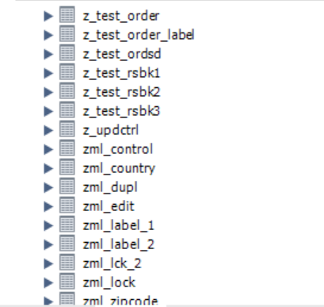

# Database snapshots

A directory containing before and after images of the Hewitt database tables. The following is a sequential overview of the table name changes that were made to the Hewitt database.

Before pic 1:

 

 

After pic 1:

 

Before pic 2:

 

 

After pic 2:

 

Before pic 3:

 

 

After pic 3:

 

Before pic 4:

 

 

After pic 4:

 

 

And the final picture of the normalized Hewitt database schema:

 

